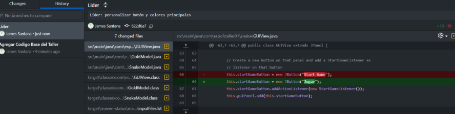
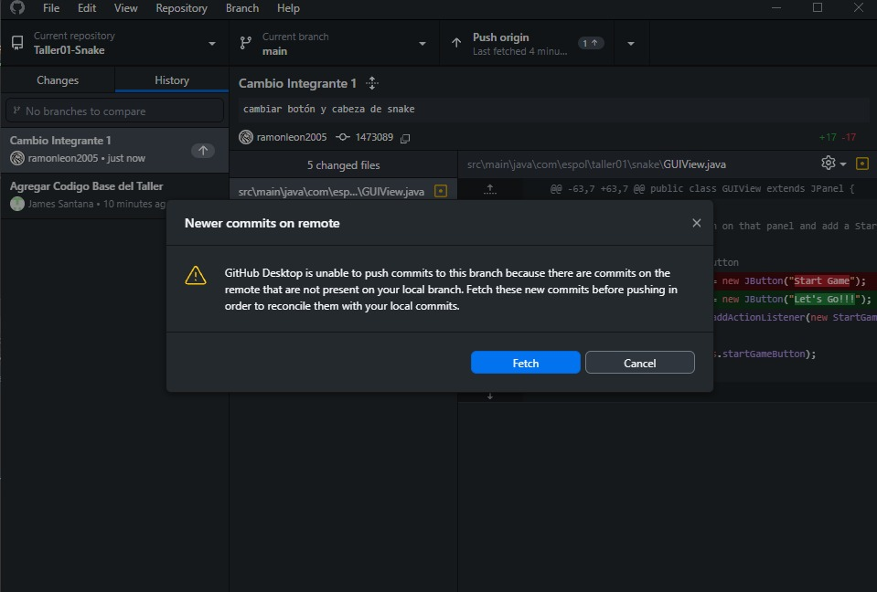
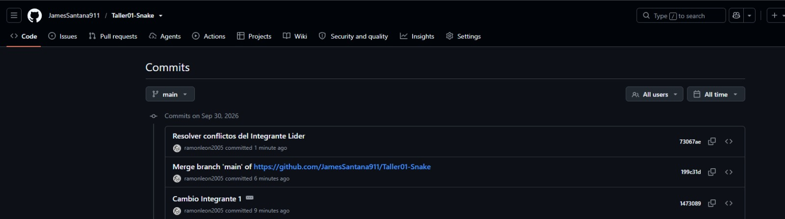
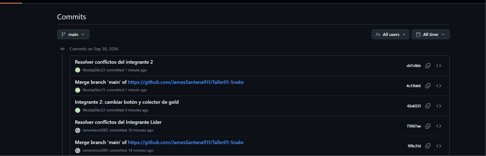

| Rol | Nombre | Usuario de GitHub | Commit principal |


| Líder | James Santana | JamesSantana911 | Agregar Codigo Base del Taller |
| Integrante 1 | Ramon Leon | ramonleon2005 | Cambio Integrante 1 |
| Integrante 2 | Nicolas Dier | nicolasdier23 | Integrante 2: cambiar botón y colector de gold |


Push exitoso:



### Integrante 1

Error antes de resolver conflicto:



Push exitoso después de resolver conflicto:



### Integrante 2

Error antes de resolver conflicto:


Push exitoso después de resolver conflicto:




```
